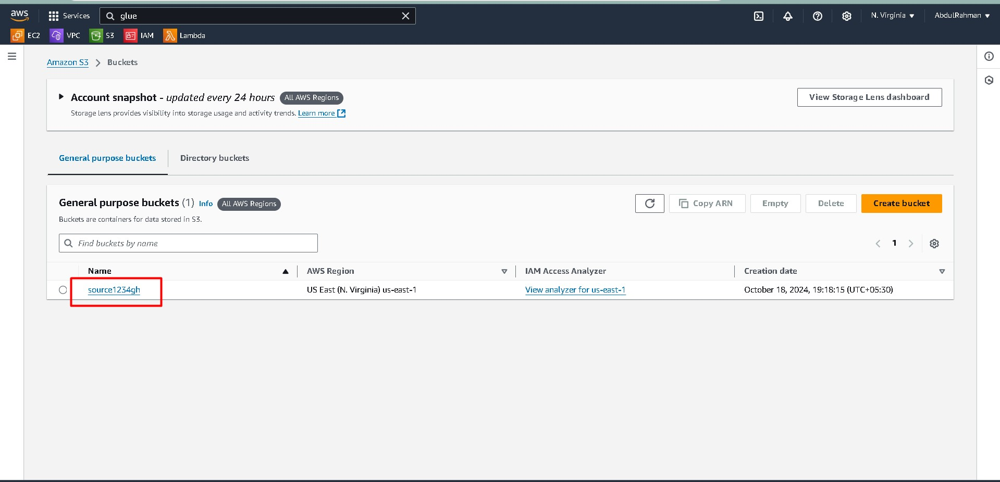
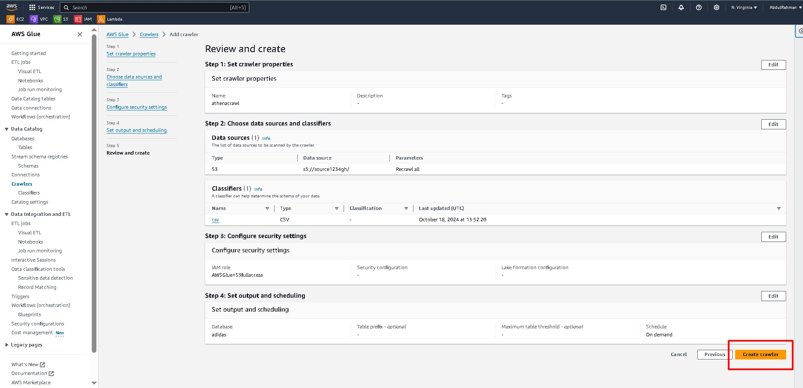
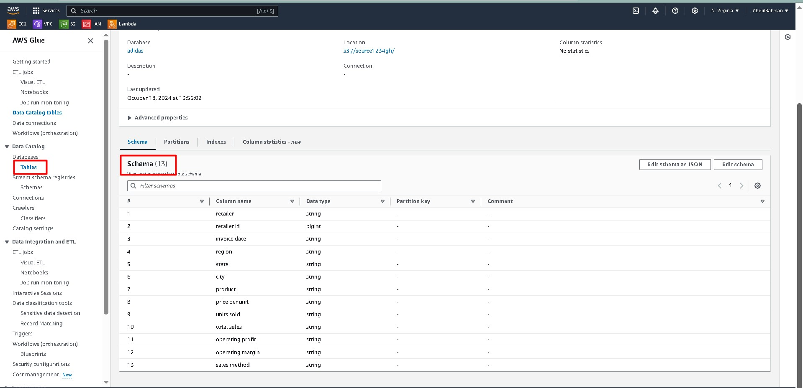
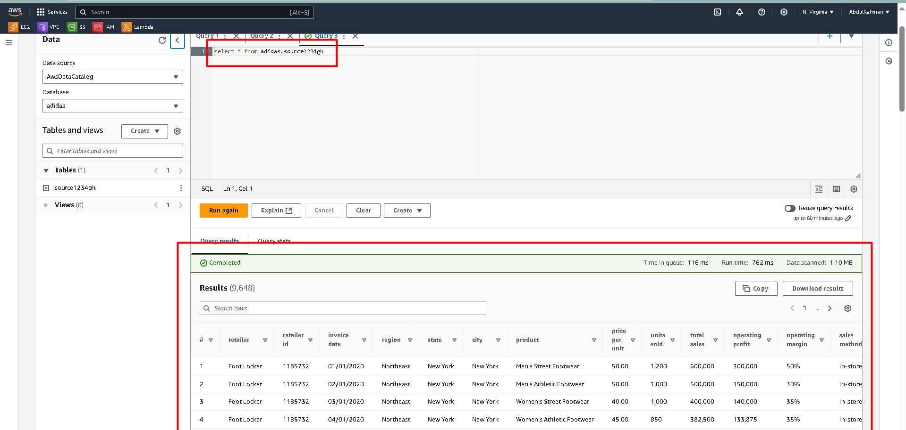

# 🛠️ Querying a CSV File in S3 with AWS Glue and Athena

This guide walks you through the process of querying a CSV file stored in an S3 bucket using **AWS Glue** and **Amazon Athena**. We'll first use AWS Glue Crawler to detect the schema and create a table in the AWS Glue Data Catalog, then use Athena to query the data.

## 🔍 Overview of the Workflow

- **Source**: Data in CSV format stored in an S3 bucket.
- **Glue Crawler**: Automatically detects the schema and creates a table in the AWS Glue Data Catalog.
- **Athena**: Used to query the data using standard SQL syntax.

---

### 💾 Step 1: Create an S3 Bucket and Upload Your CSV

1. **Source**: First, upload your CSV file to the S3 bucket.
    - Example bucket: `s3://my-csv-bucket`.
    - Ensure the file is in a readable CSV format with headers.
    
    

---

### 🔍 Step 2: Create an AWS Glue Crawler

2. **AWS Glue Crawler**: Use AWS Glue Crawler to detect the schema and populate the AWS Glue Data Catalog.
    - Go to **AWS Glue** > **Crawlers** and click on **Add Crawler**.
    - Select **S3** as your data store, and point it to the S3 bucket where the CSV is stored (e.g., `s3://my-csv-bucket`).
    - Choose an appropriate IAM role with S3 and Glue permissions.
    - Configure the crawler to run on demand or on a schedule.
    
    
---

### 📊 Step 3: Run the Crawler and Check the Data Catalog

3. **Run the Crawler**: Once the crawler has finished running, it will create a table in the AWS Glue Data Catalog with the schema detected from the CSV.
    - Go to **AWS Glue** > **Tables** and verify that the table has been created.
    - The table will be associated with the database you selected when creating the crawler.
    - Check the schema to ensure all columns are correctly detected.

    

---

### 🎯 Step 4: Query the Data Using Amazon Athena

4. **Query in Athena**: Now, use **Amazon Athena** to query the table created by the Glue Crawler.
    - Go to **Amazon Athena** and select the database where your table is stored from the dropdown menu.
    - Write a SQL query to retrieve the data. For example:
    - Make sure to add the in Settings and in Manage select the s3 path
    
      ```sql
      SELECT * 
      FROM "my_database"."my_csv_table"
      LIMIT 10;
      ```

    - Run the query to see the data from the CSV file.
    
    

---

### ✅ Final Output

By following these steps, you’ve successfully:
- Uploaded a CSV file to S3.
- Created a Glue Crawler to detect the schema.
- Queried the data using Amazon Athena.

This process simplifies querying CSV files without needing to manually manage the schema. AWS Glue and Athena together provide a powerful, serverless solution for working with large datasets.
