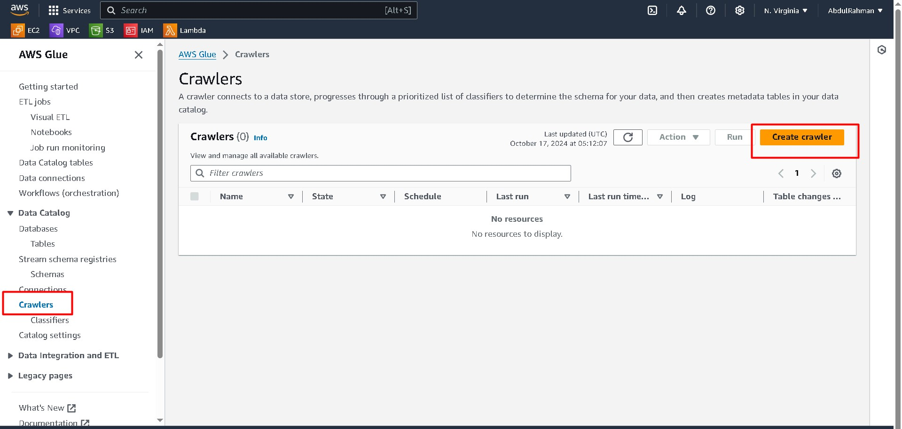
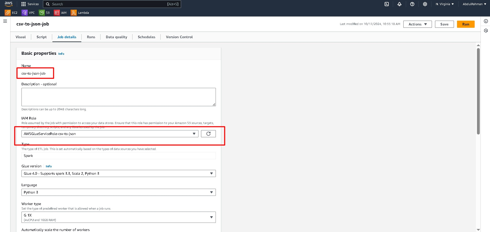

 # Introduction


In this tutorial, we will walk through the process of using **AWS Glue** to transform a CSV file stored in one S3 bucket into a JSON file, and then place it in another S3 bucket. AWS Glue is a fully managed ETL (Extract, Transform, Load) service that simplifies working with data. With AWS Glue, you can connect to data sources, automate schema discovery, and manage ETL pipelines easily.

---

## 🌟 Overview of the Process

Here's what we will do step by step:

1. **Create two S3 buckets**: One for the source CSV file and another for the transformed JSON output.
2. **Create a Crawler**: Automatically discover the structure of the CSV file and create a schema in the AWS Glue Data Catalog.
3. **Set up an IAM Role**: Ensure that AWS Glue can access your S3 buckets and perform necessary operations.
4. **Create an ETL Job**: Transform the CSV file into JSON format and store it in the destination S3 bucket.
5. **Run the Job**: Execute the ETL job and verify the output.

Let's dive into the details!

---

## 📁 Step 1: Create Two S3 Buckets

First, create two S3 buckets: one for the source data (CSV) and another for the destination (JSON).

1. Go to the **S3 Console**.
2. Create a bucket for storing the CSV file (e.g., `my-csv-bucket`).
3. Create another bucket for storing the JSON output (e.g., `my-json-bucket`).
4. Upload a CSV file to the `my-csv-bucket`. The file can be simple, like:
   ```csv
   id,name,age
   1,John,30
   2,Jane,25
   ```
   

---

## 🔍 Step 2: Create an AWS Glue Crawler

A crawler in AWS Glue automatically infers the schema of your data and adds it to the Data Catalog.

1. Go to the **AWS Glue Console**.
2. Navigate to **Crawlers** and click **Add Crawler**.


3. Name your crawler (e.g., `csv-crawler`).
4. Add a **data source** and select your S3 bucket (`my-csv-bucket`) where the CSV file is located.
5. Create a **Custom Classifier** for the CSV file to ensure that AWS Glue understands the format. You can define the delimiter as a comma (`,`) to handle CSV files.
6. Set up an **IAM Role** with permissions for AWS Glue to access your S3 buckets.
7. Choose the target database for the cataloged data. If this is your first time, create a new database (e.g., `csv_data_catalog`).

Once the crawler runs, AWS Glue will automatically create a table in the Data Catalog with the schema inferred from your CSV file.

---

## 🛠️ Step 3: Create an ETL Job in AWS Glue


Now that we have the data cataloged, let's create an ETL pipeline to convert the CSV file into JSON.

1. Go to the **AWS Glue Console** and navigate to **ETL Jobs**.
2. Click **Visual ETL** and name your job (e.g., `csv-to-json-job`).
3. Select the **Visual with Source, Transform, and Target** option to design your ETL flow visually.
4. **Source**: Choose your cataloged CSV file as the data source. Select the database and table created by the crawler.
5. **Transform**: AWS Glue automatically provides a basic transformation. You can add custom transformations here if needed.
6. **Target**: Select your destination S3 bucket (`my-json-bucket`). Set the file format to **JSON**.
7. **IAM Role**: Use the IAM role created earlier with the necessary permissions (e.g., `AWSGlueServiceRole`, `AmazonS3FullAccess`).
8. **Worker**: Choose 2 workers to ensure the job runs efficiently.



---

## ⚡ Step 4: Run the ETL Job

Once everything is set up, it's time to run the job.


1. Click **Save** and then **Run** your ETL job.
2. Monitor the job's progress from the **Jobs** section in the Glue Console.
3. After the job completes, go to your **S3 bucket (`my-json-bucket`)** to verify that the data has been transformed into JSON format.


---

## 📝 Conclusion

Congratulations! You've successfully created an ETL pipeline using **AWS Glue** to transform CSV data into JSON and move it between S3 buckets. AWS Glue makes it simple to build, manage, and automate your ETL workflows. Whether you're working with big data or small datasets, Glue is a powerful tool to streamline your data processing needs.

Feel free to explore more advanced features of AWS Glue, such as triggers, custom transformations, and integration with other AWS services.

---

 
