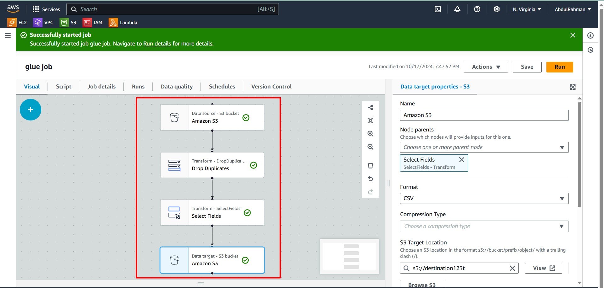
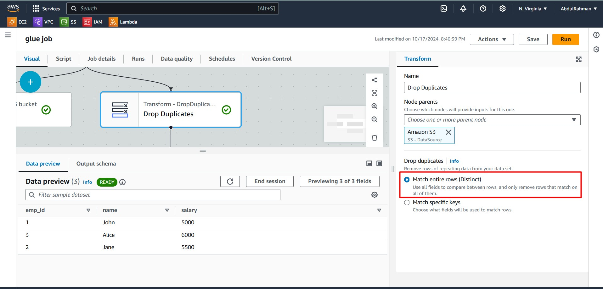
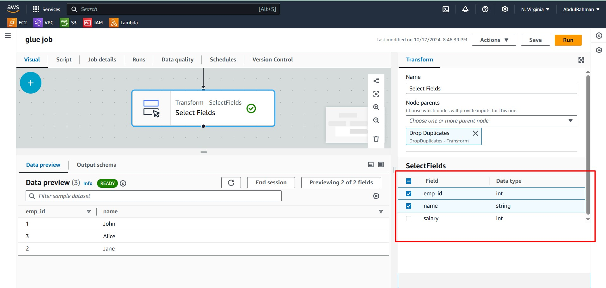
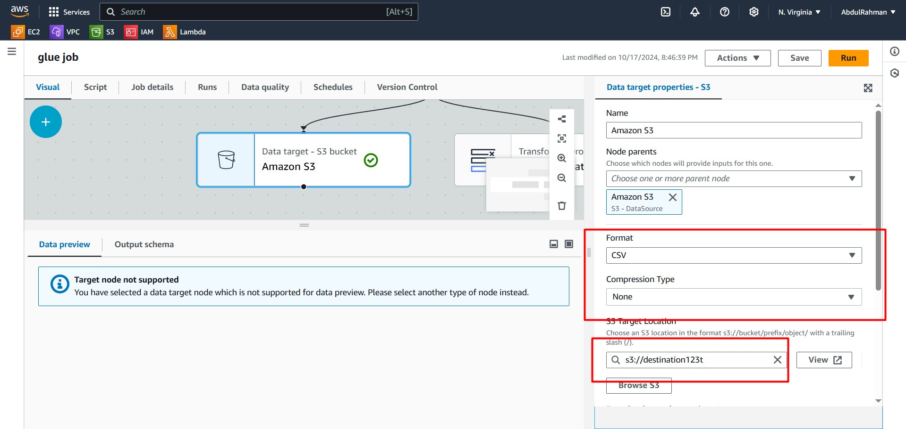

# 🛠️ AWS Glue ETL Pipeline: Visual Workflow

This tutorial describes the step-by-step process of setting up an ETL pipeline using **AWS Glue's Visual Editor**. In this pipeline, data is loaded from an S3 bucket, transformed by removing duplicates and selecting specific fields, and finally written back to an S3 bucket in a clean format.

## 🔍 Overview of the Workflow

- **Source**: Data is retrieved from an S3 bucket.
- **Transformation 1**: Remove duplicate records.
- **Transformation 2**: Select specific fields.
- **Destination**: Cleaned data is written to another S3 bucket.

---

### 💾 Step 1: Data Source (S3 Bucket)

1. **Source**: Data is fetched from the specified S3 bucket (e.g., `s3://source1235t`).
    - This is the first node in the pipeline.
    - The data is expected to be in **JSON** format.
    - AWS Glue's **S3** connector is used to load the data.
    

---

### 🧹 Step 2: Drop Duplicates

2. **Transformation**: Drop duplicate records.
    - In this step, duplicate rows from the dataset are automatically removed.
    - This is useful when dealing with datasets that may contain repeated entries.
    - The transformation is executed using AWS Glue’s built-in **dropDuplicates** function.
    

---

### 📝 Step 3: Select Fields

3. **Transformation**: Select specific fields.
    - In this transformation, only certain fields (columns) are selected from the dataset.
    - This step is important when you want to reduce data size or focus on specific attributes.
    - AWS Glue allows you to visually select the fields you want to retain.
    

---

### 🎯 Step 4: Data Target (S3 Bucket)

4. **Destination**: Cleaned data is written to a new S3 bucket.
    - After the transformations, the resulting data is saved in a **CSV** format in the destination S3 bucket (e.g., `s3://destination123t`).
    - This completes the ETL process, with the data now clean and ready for further use.
    

---

## ✅ Final Output

By following these steps, the data has been successfully extracted from the source, transformed by removing duplicates and selecting relevant fields, and then saved back into an S3 bucket in a **CSV** format.

AWS Glue makes it easy to create ETL pipelines visually, without the need to write complex code. Explore further to add more transformations and automate your workflows!
