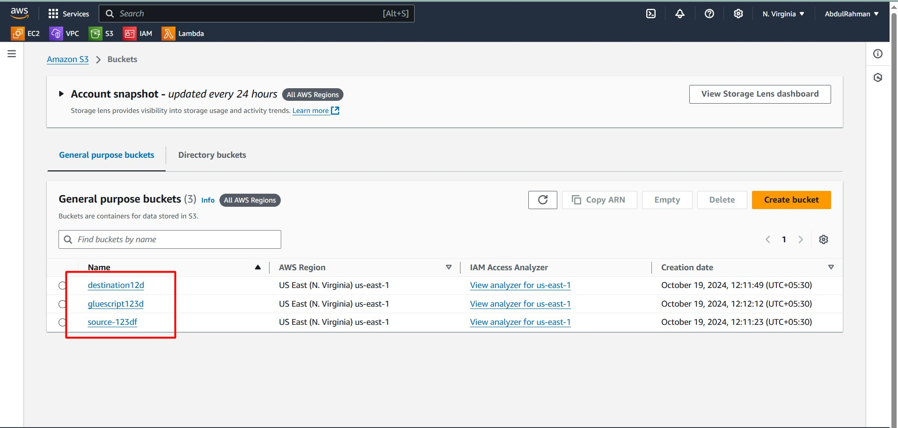
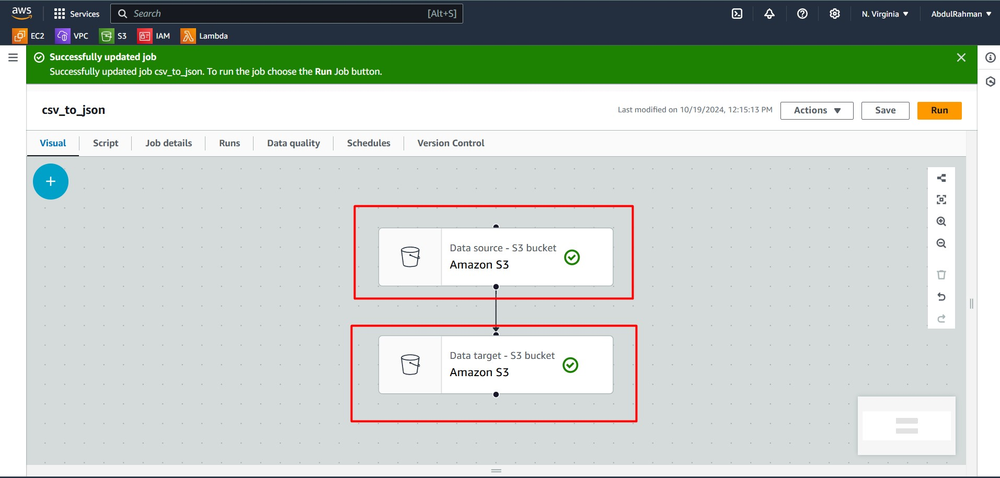
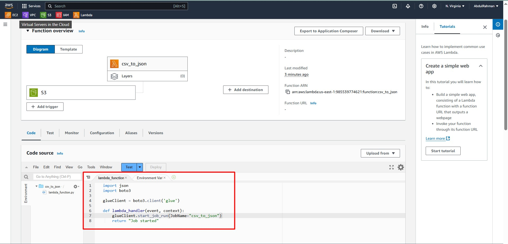
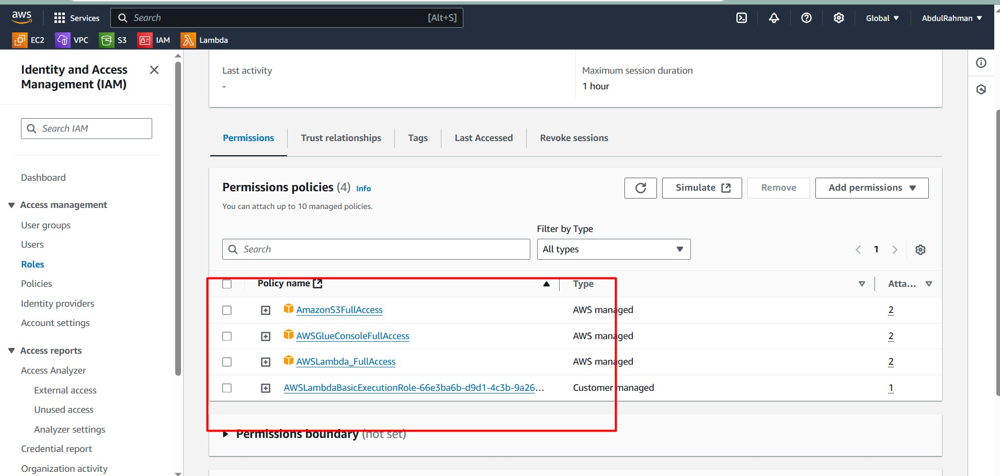
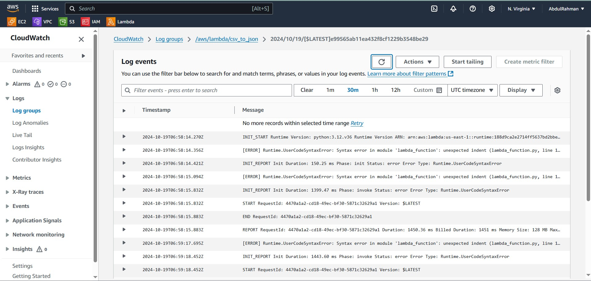

# AWS Glue: Convert CSV to JSON in S3 using Lambda
 
In this project, we will convert a CSV file stored in one S3 bucket into JSON format using **AWS Glue** and trigger the ETL process using **AWS Lambda**. We will also automate the process by setting up an **S3 Trigger** that detects the upload of CSV files and invokes the Lambda function to start the Glue job.

---

## 🌟 Overview of the Process

1. **Create three S3 buckets**: 
   - Source bucket for the CSV files.
   - Destination bucket for JSON output.
   - Script bucket to store AWS Glue ETL script.
2. **Create an AWS Glue job**: This job transforms the CSV into JSON format.
3. **Set up an AWS Lambda function**: The function triggers the Glue job based on CSV file uploads to the source S3 bucket.
4. **Monitor**: Use **CloudWatch** for monitoring the job status and logs.

---

## 📂 Step 1: Create S3 Buckets

We need to create three S3 buckets:

- **Source Bucket**: For uploading the CSV files.
- **Destination Bucket**: For storing the converted JSON files.
- **Glue Script Bucket**: To store the AWS Glue script.

1. Go to the **S3 Console**.
2. Create the following buckets:
   - `source-csv-bucket`
   - `destination-json-bucket`
   - `glue-script-bucket`
   
   

---

## 🛠️ Step 2: Create AWS Glue ETL Job

We'll now create the ETL job using **AWS Glue** to convert the CSV file into JSON.

1. Go to **AWS Glue Console** and click **Jobs** > **Visual with Source and Target**.
2. Configure the ETL job:
   - **Source**: Select the source S3 bucket (`source-csv-bucket`), and choose CSV as the format.
   - **Target**: Set the destination as the `destination-json-bucket`, format: JSON, compression: None.
   - **Script Path**: Provide the path to the script stored in the `glue-script-bucket`.
   - **Bookmark**: Enable bookmarks to avoid reprocessing files.
   
   

3. **Job Name**: Set the job name as `csv_to_json`.
4.Make sure these policies attcahed to the IAM Role **AmazonS3FullAccess, AWSGlueConsoleFullAccess , AWSGlueServiceRole, AWSLambda_FullAccess**

---

## ⚡ Step 3: Create AWS Lambda Function

We will create a Lambda function to trigger the Glue job whenever a CSV file is uploaded to the source bucket.

1. Go to **AWS Lambda Console** and create a function named `csv_to_json`.
2. Choose **Create a new IAM role** with the necessary Glue permissions.
3. Add a **Trigger**:
   - **Source**: S3 bucket (`source-csv-bucket`).
   - **Event Type**: PUT.
   - **Suffix**: `.csv`.
   - Acknowledge and add the trigger.

4. Use the following Python code for the Lambda function:

   ```python
   import json
   import boto3
   
   glueClient = boto3.client('glue')

   def lambda_handler(event, context):
       glueClient.start_job_run(JobName="csv_to_json")
       return "Job started"
   ```
   

5. **IAM Permissions**:
   - Ensure that the Lambda IAM role has the following permissions:
     - `AWSGlueConsoleFullAccess`
     - `AmazonS3FullAccess`
     - `AWSLambdaBasicExecutionRole`

   

---

## 🔍 Step 4: Monitoring

- **CloudWatch Logs**: Use CloudWatch to view Lambda execution logs and job status. This will help monitor the ETL process and debug any issues.
- **AWS Glue Console**: Check the job status under the **Jobs** section.
 
 

---

After that the converted JSON file will be in destination Bucket you can download it.

## 📊 Conclusion

You've successfully created an automated pipeline that converts CSV files into JSON format using AWS Glue, Lambda, and S3. With this approach, the process runs automatically when new CSV files are uploaded, ensuring smooth and efficient data transformation.

Feel free to expand this project by adding additional transformations, more complex ETL jobs, or integrating other AWS services like **AWS Step Functions** to orchestrate workflows.
